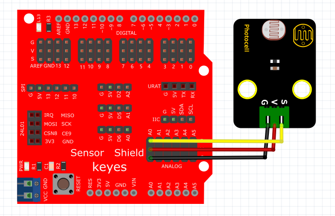
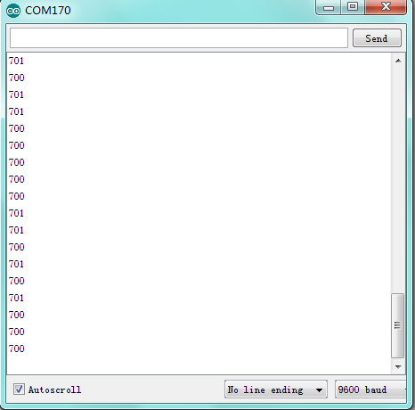

# Arduino


## 1. Arduino简介  

Arduino是一款开源电子原型平台，旨在为用户提供简单易用的解决方案，帮助他们通过硬件和软件结合实现创新项目。Arduino平台有多个版本，包括Arduino Uno、Arduino Mega等，这些板子配备了各种输入输出端口，可以与传感器、马达及其他电子组件相连接。Arduino支持通过C/C++语言进行编程，并提供了丰富的库来简化硬件控制操作。凭借其易于学习的特性和强大的功能，Arduino广泛应用于DIY项目、机器人技术、物联网应用及教育领域，成为无数创客和开发者的首选工具。  

## 2. 连接图  

  

## 3. 测试代码  

```cpp  
int sensorPin = A0; // 定义模拟口A0  
int value = 0; // 设置value为0  

void setup() {  
    Serial.begin(9600); // 设置波特率  
}  

void loop() {  
    value = analogRead(sensorPin); // 将value设置为读取到的A0的数值  
    Serial.println(value, DEC); // 显示value数值，并自动换行  
    delay(50); // 延迟0.05S  
}  
```  

## 4. 测试结果  

按照上图接好线，烧录好代码，上电后，我们可以在软件的串口监视器中看到代表当前光线强弱的模拟值，如下图所示。  




