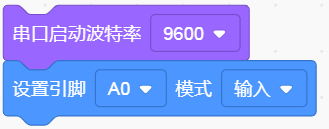
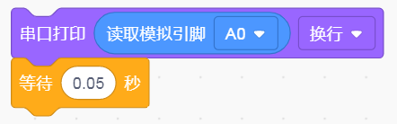
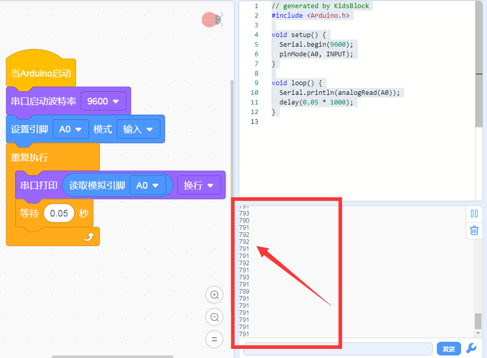

# KidsBlock

## 1. KidsBlock简介  

KidsBlock是一款针对儿童和初学者的图形化编程工具，旨在通过简单易用的拖放界面，让用户轻松学习编程。用户可以直观地通过拼图式模块构建程序，而无需深入理解复杂的编程语言。KidsBlock支持与Arduino硬件的集成，使用户能够快速上手，实现各种创意项目，如自动化装置、传感器控制及机器人项目。该工具提供了多种编程方式，包括Scratch图形编程以及Arduino C语言，鼓励用户通过实践进行交互式学习。  

## 2. 连接图  

  

## 3. 测试代码  

1. 在事件栏里拖出Arduino启动模块。  

     

2. 在串口栏拖出设置串口波特率模块并设置波特率为9600；然后在引脚栏拖出设置引脚模块设置引脚为A0，模式为输入。  

     

3. 在控制栏拖出重复执行模块。  

     

4. 在串口栏拖出串口打印模块，并添加引脚栏里的读取模拟引脚A0的模块在里面；最后添加一个延时为50ms的延时模块。  

     

## 4. 测试结果  

按照上图接好线，烧录好代码，上电后，我们可以在软件的串口监视器中看到代表当前光线强弱的模拟值，如下图所示。  

