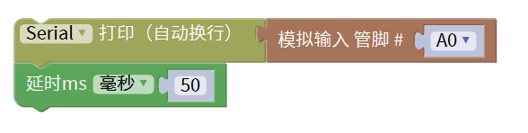
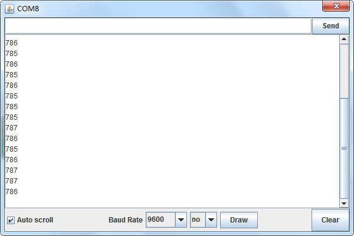

# Mixly

## 1. Mixly简介  

Mixly是一款图形化编程工具，专为儿童和初学者设计。它通过直观的拖放式界面使用户能够轻松创建程序，避免了复杂的代码输入。Mixly支持Arduino平台，并允许用户通过模块化的方式实现各种功能，如传感器控制、机器人程序和交互式项目。Mixly提供多种编程语言的支持，包括Arduino C和Scratch，增强了学习的趣味性和实用性，适合于教育和DIY项目，帮助用户在实践中掌握编程基础。  

## 2. 连接图  

  

## 3. 测试代码  

  

## 4. 测试结果  

按照上图接好线，烧录好代码，上电后，我们可以在软件的串口监视器中看到代表当前光线强弱的模拟值，如下图所示。  

