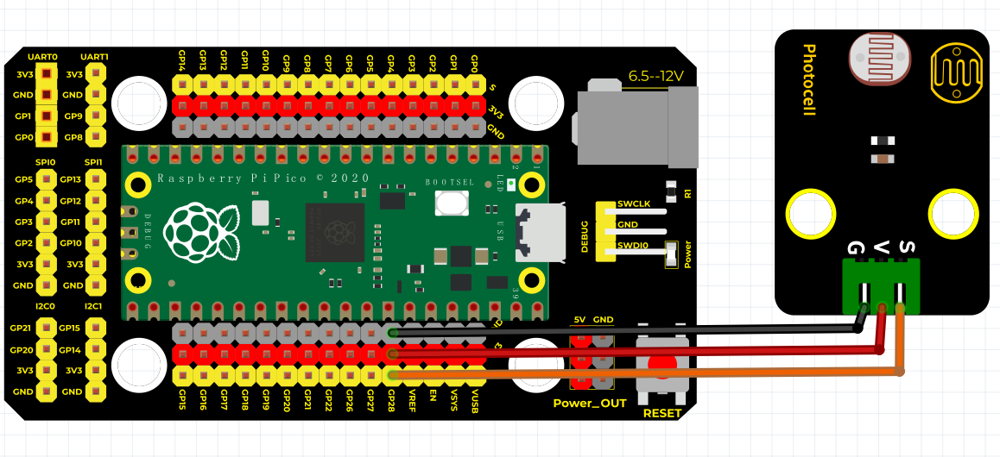
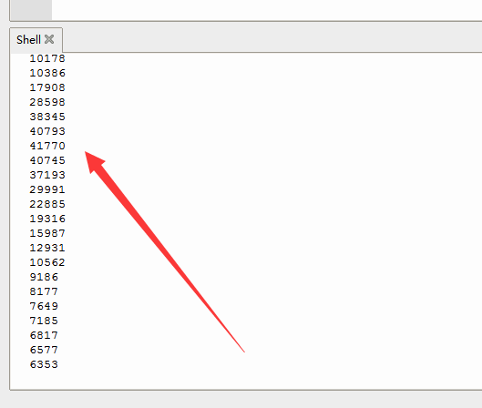

# Python


## 1. Python简介  

Python是一种高级编程语言，以其简单易读的语法和强大的功能而受到广泛欢迎。自1991年发布以来，Python在多个领域发挥着重要作用，包括Web开发、数据科学、人工智能、自动化及科学计算。Python支持多种编程范式，如面向对象、函数式和命令式编程，使其适用于不同类型的项目。它拥有丰富的标准库和第三方模块，用户可以轻松实现复杂的功能。由于其易于学习的特性，Python也被广泛用于教育和研究，使越来越多的人能够进入编程世界。  

## 2. 连接图  

  

## 3. 测试代码  

```python  
import machine  
import utime  

sensorPin = machine.ADC(28)  # 设置28脚为模拟脚  

while True:  
    reading = sensorPin.read_u16()  # 读取模拟值  
    print(reading)  # 打印模拟值  
    utime.sleep_ms(50)  # 延时50ms  
```  

## 4. 测试结果  

按照上图接好线，烧录好代码，上电后，我们可以在软件的串口监视器中看到代表当前光线强弱的模拟值，如下图所示。  




